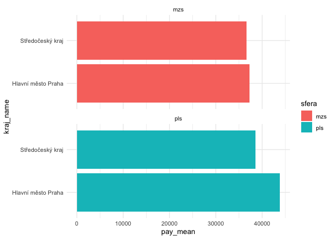

<!-- README.md is generated from README.Rmd. Please edit that file -->

# ispv

<!-- badges: start -->
<!-- badges: end -->

The goal of ispv is to retrieve and load data from the Czech database of
average earnings (ISPV, Informační systém o průměrném výdělku).

## Installation

You can install the development version of ispv like so:

``` r
remotes::install_github("petrbouchal/ispv")
```

## Example

The package does two things, either for national or regional data:

-   retrieve links to Excel files on the ISPV site for a given year
-   read those data and return in a clean tibble ready for analysis

Here is an example for regional data:

``` r
library(ispv)

links <- pv_list_reg(2020)

paths <- file.path(getwd(), links$name[c(1, 2, 15, 16)])
purrr::map2(links$url[c(1, 2, 15, 16)], paths, curl::curl_download)
#> [[1]]
#> [1] "/Users/petr/csandbox/ispv/Pra_204_mzs.xlsx"
#> 
#> [[2]]
#> [1] "/Users/petr/csandbox/ispv/Str_204_mzs.xlsx"
#> 
#> [[3]]
#> [1] "/Users/petr/csandbox/ispv/Pra_204_pls.xlsx"
#> 
#> [[4]]
#> [1] "/Users/petr/csandbox/ispv/Str_204_pls.xlsx"

data <- pv_load_reg(paths)

data
#> # A tibble: 545 × 22
#>    kraj_id_ispv file        isco4_full fte_thous pay_median pay_d1 pay_q1 pay_q3
#>    <chr>        <chr>       <chr>          <dbl>      <dbl>  <dbl>  <dbl>  <dbl>
#>  1 Pra          /Users/pet… 1120 Nejv…     1.25     147534. 39480. 66898. 3.04e5
#>  2 Pra          /Users/pet… 1211 Řídí…     2.84     100871. 44964. 68750. 1.59e5
#>  3 Pra          /Users/pet… 1212 Řídí…     0.900    100313. 45651. 64583. 1.66e5
#>  4 Pra          /Users/pet… 1219 Osta…     1.62      76178. 31050. 49090. 1.31e5
#>  5 Pra          /Users/pet… 1221 Řídí…     4.88      91330. 38618. 56198. 1.47e5
#>  6 Pra          /Users/pet… 1223 Řídí…     0.989     99731. 45760. 67100. 1.43e5
#>  7 Pra          /Users/pet… 1321 Řídí…     1.44      67123. 20246. 44127. 1.12e5
#>  8 Pra          /Users/pet… 1323 Řídí…     2.07      75469. 31909. 49077. 1.04e5
#>  9 Pra          /Users/pet… 1324 Řídí…     2.40      72326. 35602. 48826. 1.10e5
#> 10 Pra          /Users/pet… 1330 Řídí…     2.81     115329. 52052. 73825. 1.62e5
#> # … with 535 more rows, and 14 more variables: pay_d9 <dbl>, pay_mean <dbl>,
#> #   bonus_perc <dbl>, supplements_perc <dbl>, compensation_perc <dbl>,
#> #   hours_per_month <dbl>, sfera <chr>, period <chr>, year <chr>,
#> #   isco4_id <chr>, isco4_name <chr>, kraj_id <chr>, kraj_name <chr>,
#> #   kraj_id_nuts3 <chr>
```

This is a long format data frame, so is easy to analyse and visualise:

``` r
library(dplyr)
data_select <- data |> 
  filter(isco4_name == "Mzdoví účetní")
```

``` r
library(ggplot2)
ggplot(data_select, aes(pay_mean, kraj_name, fill = sfera)) +
  geom_col() +
  facet_wrap(~sfera, ncol = 1) +
  theme_minimal()
```



## About the data

The data is special in several ways:

-   it contains pay and staff counts broken by ISCO-4 level for each
    region (kraj), further separated into the “wage sphere” and “salary
    sphere” - broadly private and public sector, respectively
-   pay is broken down into regular pay, bonuses, other compensation and
    other components

This is probably the most detailed labour market data available
publicly.

See details on the official page:
[English](https://ispv.cz/en/about-ispv.aspx) and
[Czech](https://ispv.cz/cz/O-ISPV.aspx)

The data is only available to the public in Excel files, separately for
each year and region. This package makes it possible to download and
read the data in bulk.

The public sector part of the data is based on individual-level returns
provided by each public sector organisation. The private sector part is
based on a survey.

The data items are documented in the relevant data loading functions,
i.e. currently only `pv_load_reg`.

## Limitations of the package

The source data contains multiple breakdowns and other types of
information. Currently, the package only supports loading the
pay-and-headcount table with the ISCO-4 job classification breakdown.

## Credits

The data is collected and managed by Trexima on behalf of the Czech
Ministry of Labour and Social Affairs.

This package is not affiliated with or endorsed by the ministry, but
they deserve credit for commissioning the data collection and
maintenance.
